# 自身のPCでの環境構築について


情報教育システム以外，つまり各自のPCにて，本授業のロボットライブラリとサンプルプログラムを実行するための方法（環境構築）について，下記に示します．サンプルプログラムは，[こちら](./src/robot_sample.zip) ．

## windows環境

### インストールすることが必要なもの
- 適当なテキストエディタ ex.[Visual Studio Code](https://azure.microsoft.com/ja-jp/products/visual-studio-code/)， [Notepad++](https://notepad-plus-plus.org/), メモ帳（Windows付属）などなど．なお，Wordはテキストエディタではありません．
- [MSYS2](https://www.msys2.org/)

### ソフトウエアの準備

#### テキストエディタ

- [Visual Studio Code](https://azure.microsoft.com/ja-jp/products/visual-studio-code/)
- [Notepad++](https://notepad-plus-plus.org/)
- [サクラエディタ](https://sakura-editor.github.io/)
などから，好みのものをインストールしてください．Windowsに標準でインストールされているメモ帳でも構いませんが，シンタックスハイライトがないなどちょっと使いづらいかもしれません．

#### MSYS2のインストール

[公式](https://www.msys2.org/)のページの中段あたりにあるmsys2-x86_64-xxxxxxxx.exeをダウンロードして，インストール．初期設定から特に変更する必要はありません．

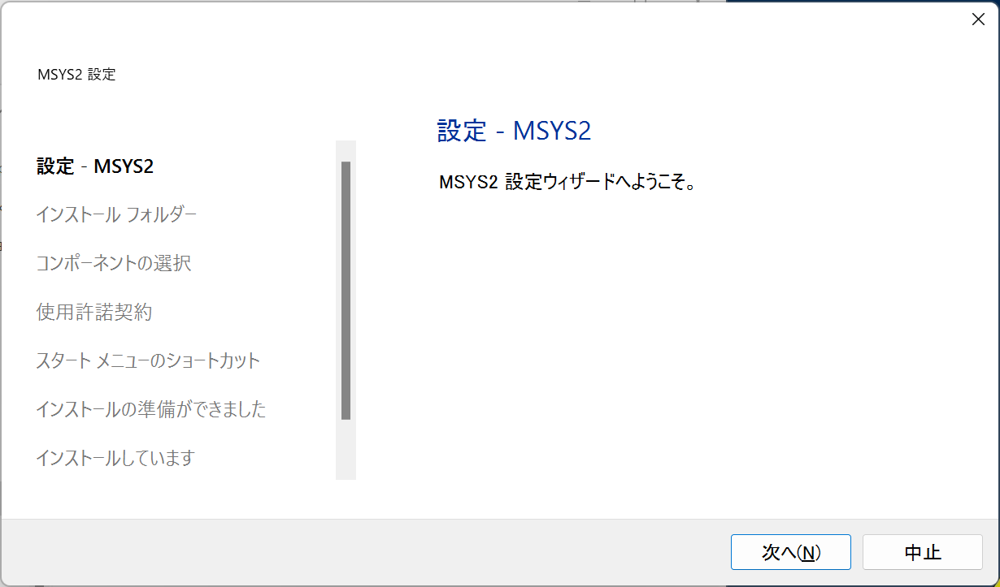
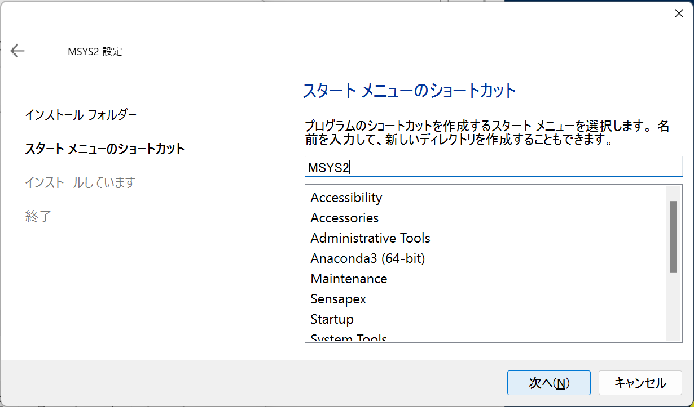

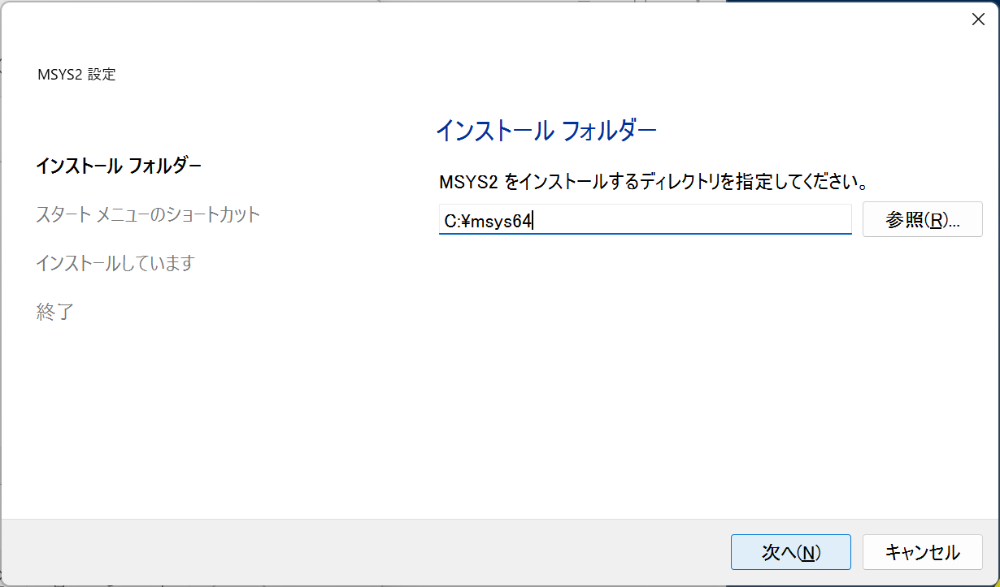
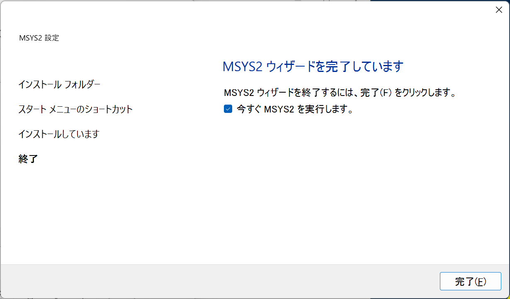

#### C言語の開発環境他をインストール

まずMSYS2 MINGW64を起動．MSYS2をインストールすると，MINGW64, MINGW32, UCRT64, CLANG64などもインストールされますが，使うのはMINGW64です．

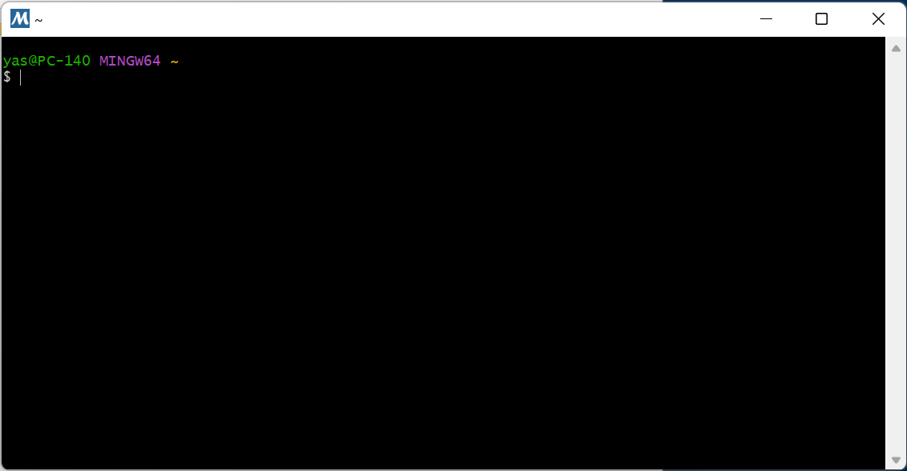


下記コマンドを実行し，C言語の開発環境他をインストールします．

```
pacman -S mingw-w64-x86_64-gcc mingw-w64-x86_64-freeglut mingw-w64-x86_64-gdb
```

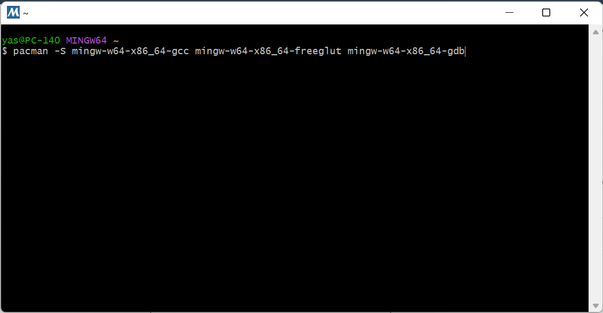

途中インストールを進めていいですか？と聞かれるので，`y`を押して進めます．

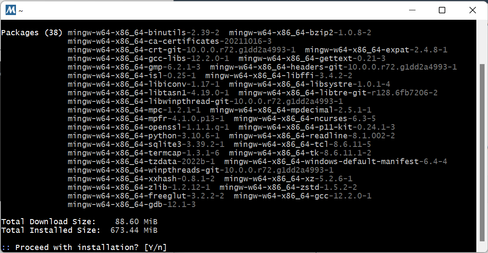

### 動作確認

前もって，[サンプルプログラム](./src/robot_sample.zip) を入手します．これはいくつかのファイルをまとめた圧縮ファイル(zip)となっていますので，展開して適当なディレクトリ（フォルダ）に置いておきます．

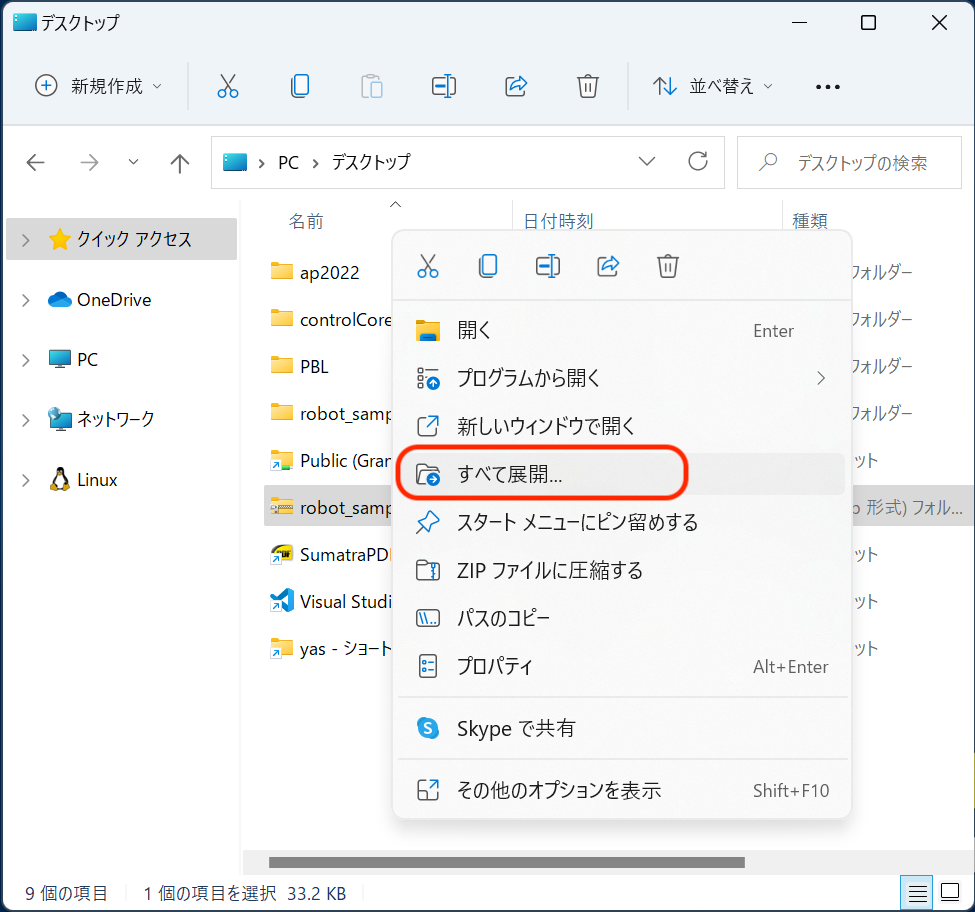

ここでは，デスクトップ上にrobot_sample.zipを展開し，`robot_sample`というフォルダーができた状態となっています．

エディタ(VScodeで)，robot_sampleのフォルダーを開いてみます．

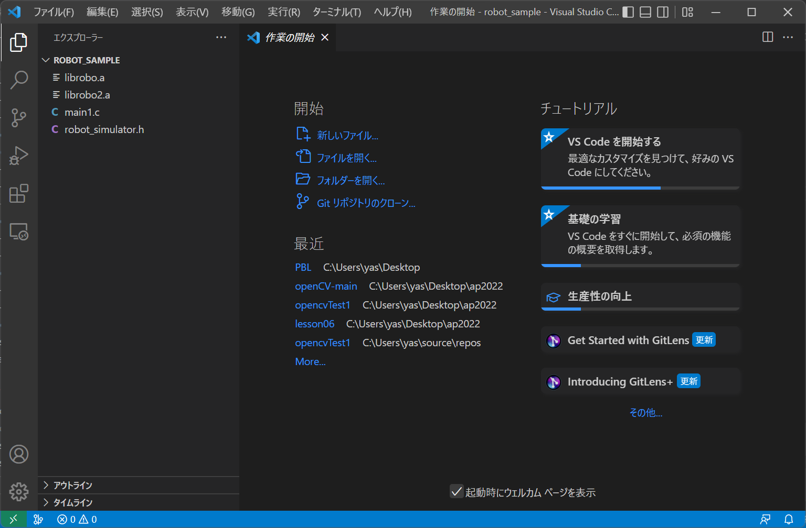
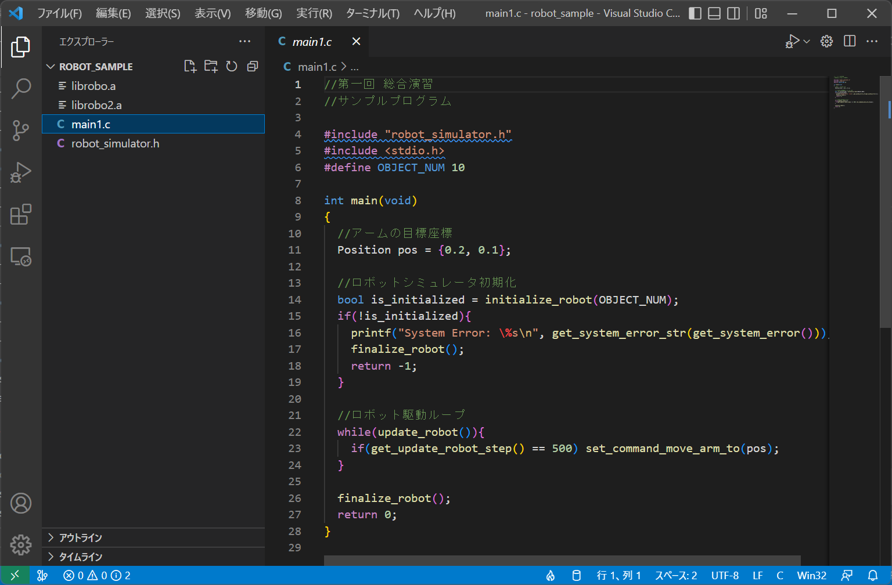

動作確認では，特にファイルを編集する必要はありません．
### コンパイル

MSYS2 MINGW64上で，プログラム（コード）があるディレクトリに移動します．MSYS2上では，windows上のファイルは`/c/Users/hoge/`以下に見えます（`hoge`はそれぞれのユーザー名）．なので，`hoge`さんが，デスクトップにある，`robot_sample`というフォルダーに移動したければ，
```
cd /c/Users/hoge/Desktop/robot_sample
```
とすればよいです．

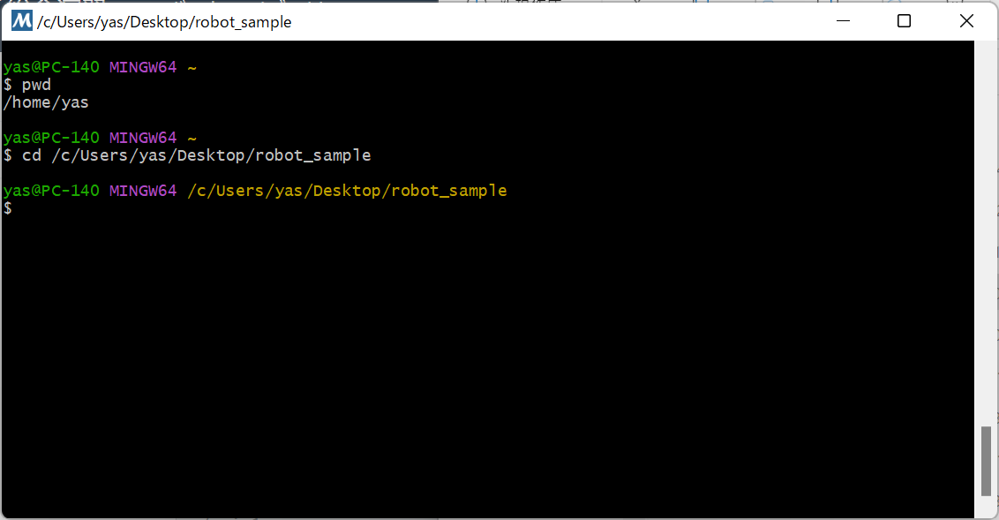

わかりにくければ，移動したいディレクトリ（フォルダ）をDrag&Dropしてもよいです．


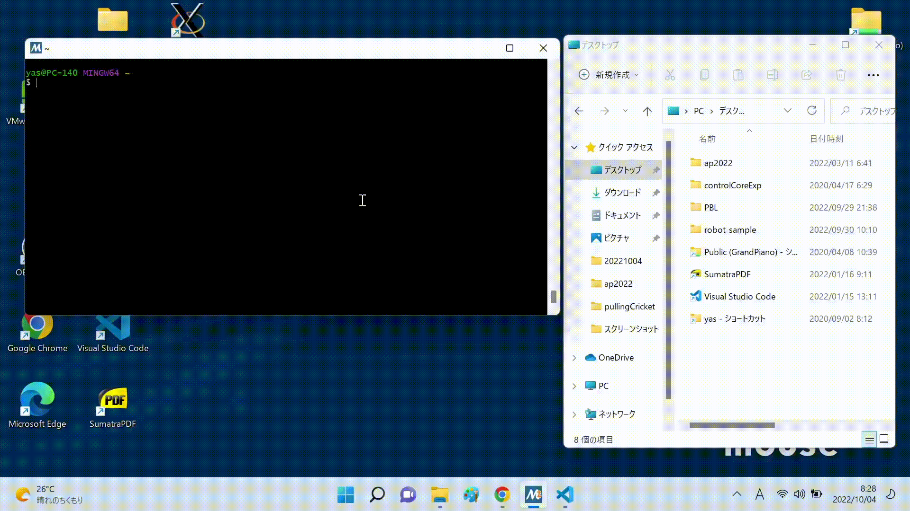


サンプルプログラムのコンパイルは，以下で行います．
```
gcc main1.c -o main1 -L. -lrobo -lm -lpthread -lfreeglut -lopengl32 -lglu32
```

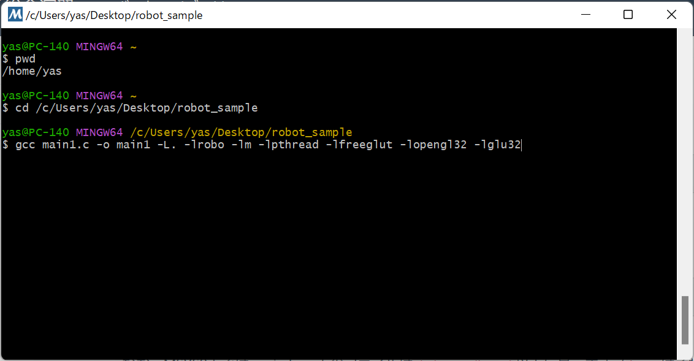

### 実行

実行はいつも通り．
```
./main1.exe
```

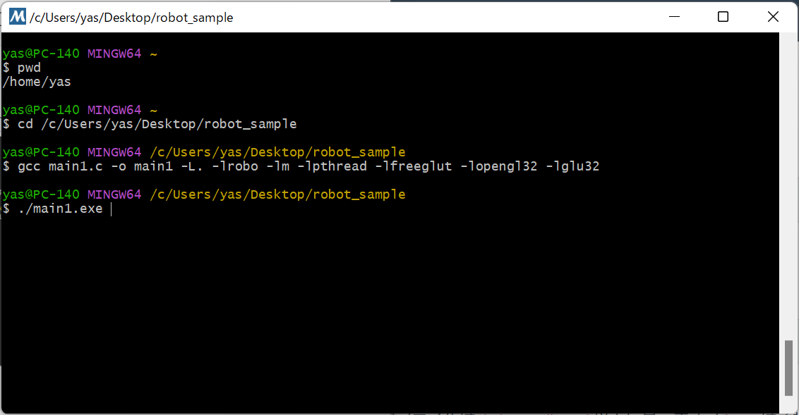

問題なければ，Robot simulatorが起動します．

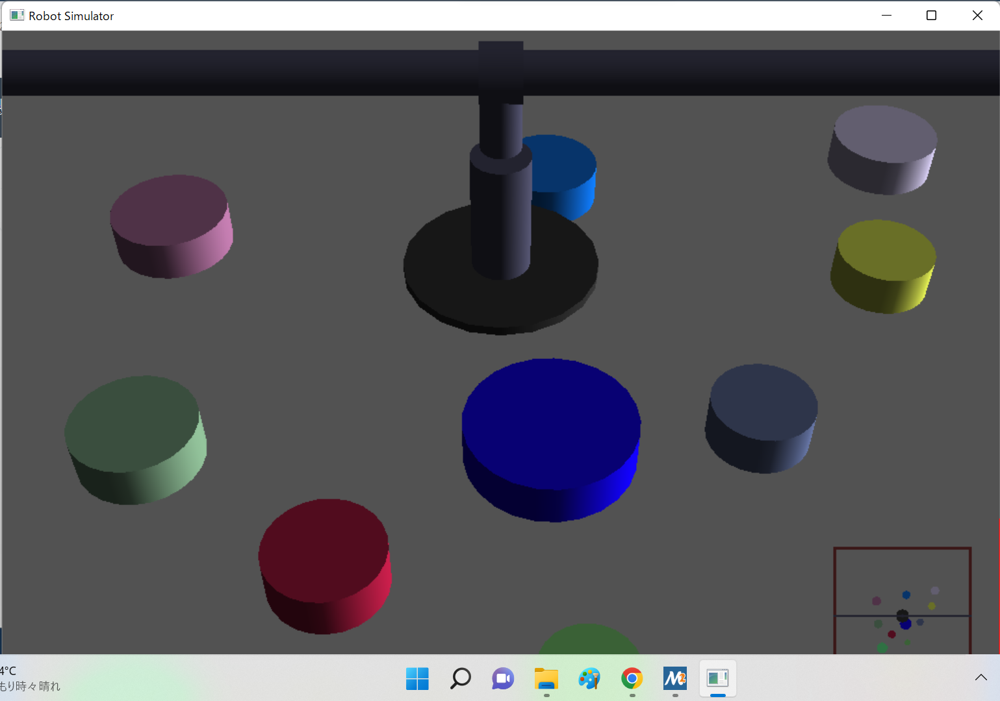

`q`を押せば終了します．

###　(optional) VScode + MSYS2 MINGW64

少しVScodeの設定が必要ですが，VScode上のターミナルでMSYS2 MINGW64が動くようにしておくと，VScode上でコンパイル・実行ができるようになり便利です．https://qiita.com/chirimen/items/04e2e10c86c9ecd1e158　を参考に各自設定してみてください．（VScodeの設定ファイルであるsettings.jsonに，プロパティ terminal.integrated.profiles.windows の設定を書けばできます．settings.jsonの編集方法は，https://qiita.com/y-w/items/614843b259c04bb91495　を参照）


その他参考．[msys2, vscode, ターミナル](https://www.google.com/search?q=vscode+msys2+%E3%82%BF%E3%83%BC%E3%83%9F%E3%83%8A%E3%83%AB&sxsrf=ALiCzsai3H4bY8-bEBab2nePLr4eOGY9aQ%3A1664501931191&ei=q0g2Y8mlC9GMmAXo3o3wDw&ved=0ahUKEwiJp9jysLv6AhVRBqYKHWhvA_4Q4dUDCA4&uact=5&oq=vscode+msys2+%E3%82%BF%E3%83%BC%E3%83%9F%E3%83%8A%E3%83%AB&gs_lcp=Cgdnd3Mtd2l6EAMyBQgAEIAEOgoIABBHENYEELADOgQIABAeOgcIABCABBAESgQIQRgASgQIRhgAUPcGWMAWYM8YaAFwAXgAgAGbAYgBgguSAQQxLjEwmAEAoAEByAEKwAEB&sclient=gws-wiz)


## OS X環境

### 必要なもの

- xcode （App Storeから）
- [homebrew](https://brew.sh/index_ja)
- [XQuartz](https://www.xquartz.org/)
- mac用のロボットライブラリ （[librobo_mac.a](src/librobo_mac.a)および[librobo2_mac.a](src/librobo2_mac.a)）
- 適当なテキストエディタ ex.[Visual Studio Code](https://azure.microsoft.com/ja-jp/products/visual-studio-code/)など

Attention: 環境によっては，homebrewがうまくインストールされない場合があるようです．
homebrewのインストール先を変更することで，上手くいくこともあるようですが（[参考](https://shiro-changelife.com/error-cannot-install-in-homebrew/)），どうしても上手くいかない場合は，homebrewとfreeglutのインストールはあきらめましょう．xcodeをいれることでcのコンパイラは入りますので，総合演習の前までは，自身のPCで演習（課題）を行えます．総合演習は大学の情報教育システムを利用して演習を行って下さい．

### ソフトウエアの準備
#### 準備1(XQuartzのインストール)

[公式](https://www.xquartz.org/)から，dmgをダウンロードしてインストール．

#### 準備2(Xcodeのインストール)

Mac App StoreからXcodeを入手してください．

その後，ターミナル（/アプリケーション/ユーティリティ以下にあります）を起動し，CommandLineToolsをインストールします．

```
xcode-select --install
```

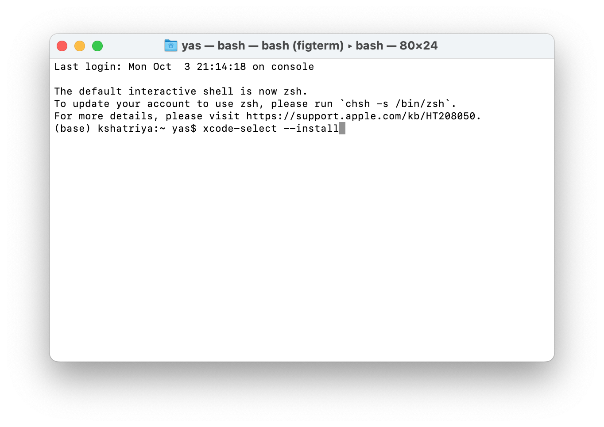

これで，Cのコンパイラ等がインストールされます．

#### 準備3(homebrewのインストール)

homebrewをインストールします．[本家](https://brew.sh/index_ja)の指示通り，ターミナル上で以下を実行します．

```
/bin/bash -c "$(curl -fsSL https://raw.githubusercontent.com/Homebrew/install/HEAD/install.sh)"
```

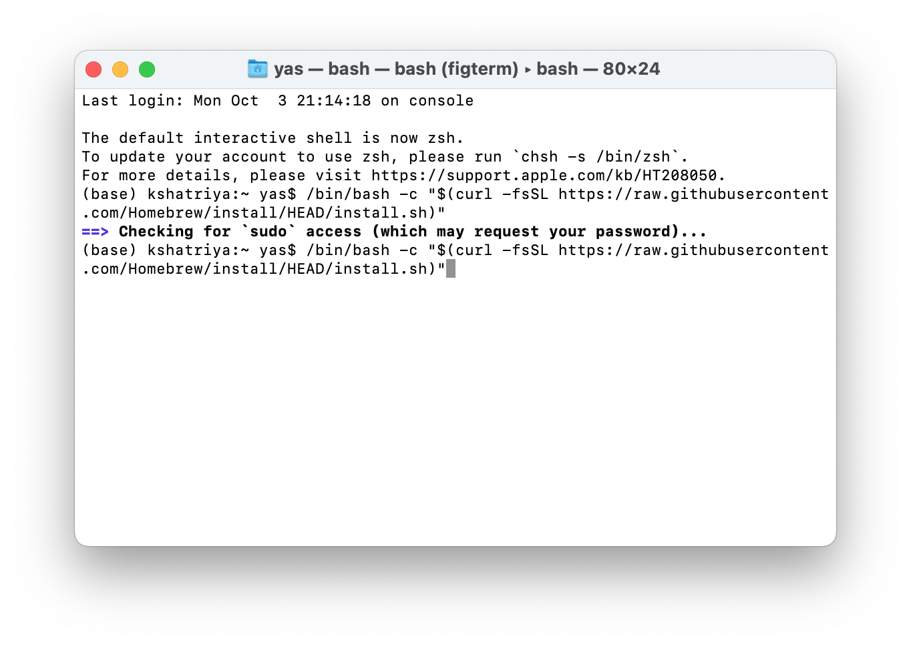


#### 準備4(ライブラリーのインストール)

ターミナル上で，homebrewを使ってfreeglutをインストールしてください．

```
 brew install freeglut
```

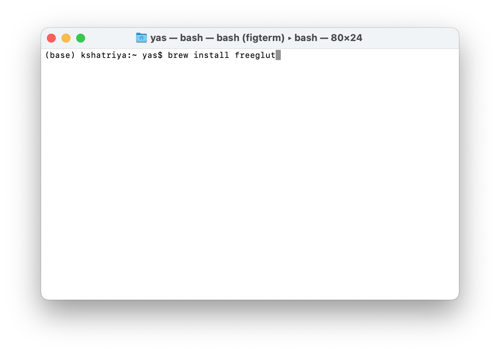

### 動作確認
#### コンパイル

前もって，[サンプルプログラム](./src/robot_sample.zip) を入手して，適当なディレクトリ（フォルダ）に展開して置いておきます．さらに，そのフォルダーにmac用のロボットライブラリ （[librobo_mac.a](src/librobo_mac.a)および[librobo2_mac.a](src/librobo2_mac.a)）にコピーします．

そのディレクトリに移動します．

アカウント名`hoge`さんが，デスクトップにある，`robot_sample`というフォルダーに移動したければ，
```
cd /Users/hoge/Desktop/robot_sample 
```
を実行します．

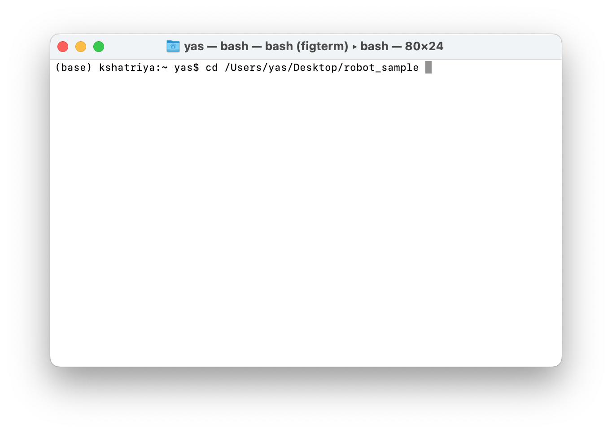

その後

```
 gcc main1.c -o main1 -L. -lrobo_mac -lm -lpthread -lglut -lGL
```

とすることで，コンパイルできます．windows(msys2)とはちょっとコンパイルオプションが異なることに注意．

M1やM2 mac(ARM Mac)の場合で上手くいかない場合は，
```
 gcc main1.c -o main1 -L. -L/opt/homebrew/lib -lrobo_mac -lm -lpthread -lglut -lGL 
```
と，`-L/opt/homebrew/lib`をオプションに追加してください．


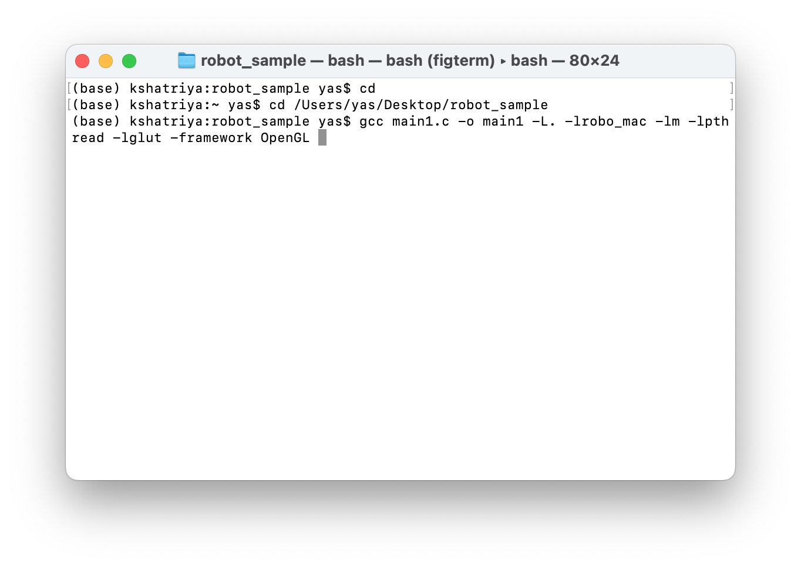

librobo2を使うときは，
```
 gcc main1.c -o main1 -L. -lrobo2_mac -lm -lpthread -lglut -lGL 
```
になります．M1やM2 mac(ARM Mac)の場合は，
```
 gcc main1.c -o main1 -L. -L/opt/homebrew/lib -lrobo2_mac -lm -lpthread -lglut -lGL 
```
になります．

#### 実行

まず，XQuartz.appを起動しておきます．起動すると一つターミナルが開きますが，これは使いませんので，閉じてしまっても構いません．

その後，コンパイルを行ったところで，
```
./main1
```
で実行できます．

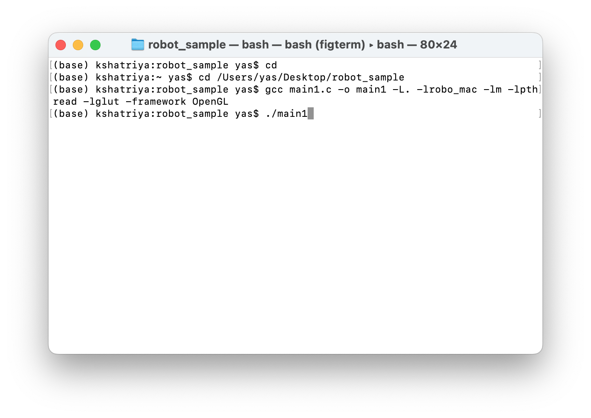


