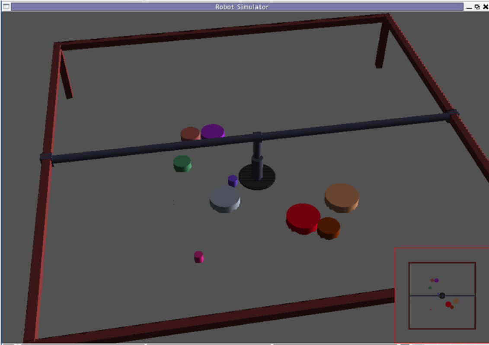

# 2025年度後期 計算機とプログラミング 総合演習

## 総合演習の目的

これまでの「計算機とプログラミング」の講義と課題で学んだ技術を応用して，以下の体得を目的とします．

- これまでに学んだ基礎的事項の活用法
- 統合されたシステムを構築する上での技術課題とその解決方法

## 内容

物体を掴んで移動させるロボットを用いて，フィールド上に散らばった物体を条件に従って並べ替えるプログラムの開発

応用例）ロボットによる製造ラインでの自動作業，倉庫管理，瓦礫撤去・分類

## 担当教員

- 杉本 yas [at] mech.eng.osaka-u.ac.jp
（[at]を@に置き換えてください）

## 日程

- 第1回 12/25, 26
- 第2回 1/8, 9
- 第3回 1/22, 23

