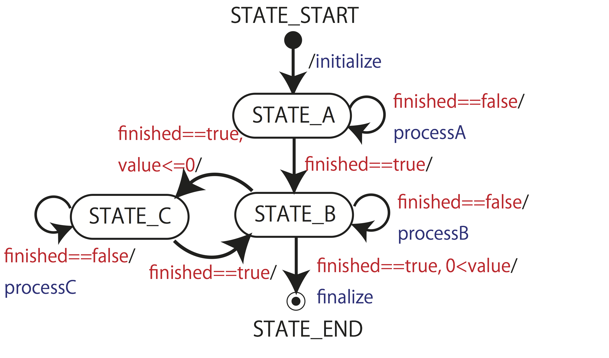
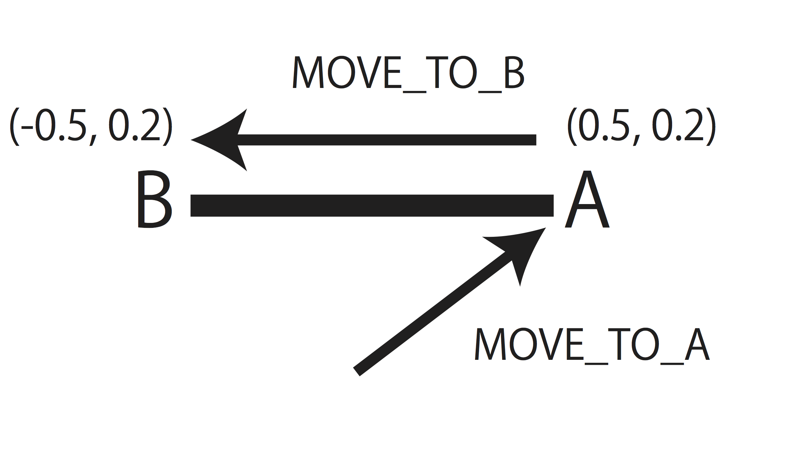
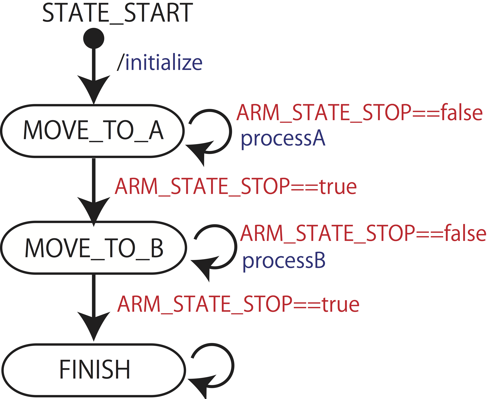
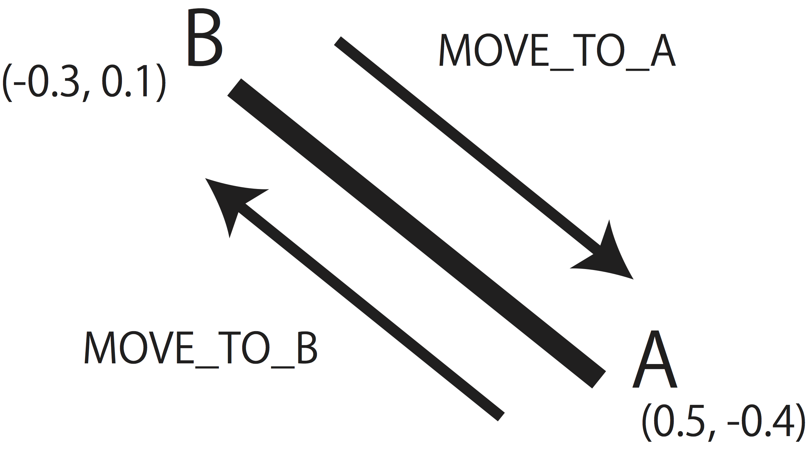

# 第1回 ロボットを動かそう

## ロボットプログラミング

### 基本構造と設計手法

知能ロボットは常に環境の情報を受け取りながら適切な行動を決定し，実行します．そのため，常に

- ロボット自身と環境情報の取得
- 取得した情報に基づく行動決定
- 行動の実行と制御

のループを短い周期で定期的に実行するプログラムを書く必要があります．

具体的には，while文などで無限ループを構成し，システムに用意されたsleep関数やwait関数を用いて次の処理を開始するまでプロセスを停止する方法があります．ロボットプログラムは大規模となることが多く，また，ロボットが人や環境に危害を加えないことが条件となるため，見通しの良い，バグの少ないプログラム開発が望まれます．そこで，よく使われる設計手法である構造化プログラミングと状態遷移を紹介します．

### 構造化プログラミングと状態遷移

構造化プログラミング：全体の処理を排他的なモジュールに分割し，組み合わせて構築することで，見通しの良いプログラムを目指す考え方
  
このモジュールを状態とみなし，それらの状態の遷移として課題を表現します．
  
例として，以下の状態遷移を考えます．

1. 状態Aの処理が終了したら状態Bへ
2. 状態Bの処理が終了したときにvalueが0より大きければ終了
3. 状態Bの処理が終了したときにvalueが0以下ならば状態Cへ
4. 状態Cの処理が終了したら状態Bへ

この状態遷移を図に示すと以下の通りです．




このような状態遷移を作成するとプログラムの整理ができ，共同での設計や議論がしやすくなります．達成したい課題があるとき，まずは状態を定義して，状態遷移図を描いてから，プログラミングに取り掛かるように心がけましょう．

ロボットによる物体操作の場合，次のように状態を定義できます．

- 状態A：アームを物体へ接近する行動
- 状態B：物体を掴む行動
- 状態C：掴み損ねて物体を落としたときに再準備する行動
- value：物体を掴んでいれば0より大きな値を示すセンサ値

## 本演習で想定するロボットシミュレータ

- グリッパ（ロボットの手）により物体を掴んでその位置を移動させるガントリー（直交）型ロボット
- 物体把持に失敗することもある．
- 物体の位置・形状・色を読み取る視覚センサ
- 把持中の物体の重さを計測する重量センサ
- 基本動作・センシングのライブラリ

第一回では，まず，ロボットのアームの動かし方を学びます．

## 準備

[こちら](./library.md#%E6%BA%96%E5%82%99)を参考に，サンプルプログラムをダウンロードし，それに含まれるmain1.cをコンパイルおよび実行できるようにしてください．


## アームの駆動

main1.cを解説します．[こちら](./library.md#%E3%83%98%E3%83%83%E3%82%BF%E3%82%99%E3%83%95%E3%82%A1%E3%82%A4%E3%83%AB)およびヘッダファイルrobot_simulator.h中のコメントと併せて見てください．


まず，
```
 #include "robot_simulator.h"
```
で，ヘッダファイルを読み込みます．
```
 #define OBJECT_NUM 10
```
で，物体の数を指定しています．

main関数の中ですが，まず，
```
 initialize_robot(OBJECT_NUM);
```
でOBJECT_NUM個の物体のあるシミュレーション環境を初期化しています．この関数は初期化に失敗するとfalseを返すので，以降で，その場合のエラー処理をしています．もし，エラー（!is_initialized）なら，
```
 finalize_robot();
```
でシミュレーションを終了します．

次に，
```
 Position pos = {0.2, 0.1};
```
で，Position構造体にアームの目標座標を代入しています．

ここから，ロボットシミュレーションの実行になります．
```
 while(update_robot()){
      /* 処理 */
 }
```
によって，update_robot関数がfalseを返すまで，処理をループさせます．このupdate_robot関数により，シミュレーションを実行します．1回の関数呼び出し（1回のwhileループ）で，シミュレーションの実行時間ステップが1増加します．
  
現在の実行時間ステップ数は関数
```
 int get_update_robot_step();
```
で取得できます．今回，ロボットが動き始める前に，300ステップ待つことにします．その処理は，
```
 if(get_update_robot_step() == 300) set_command_move_arm_to(pos);
```
の条件文に反映されています．
  
ここで，関数
```
 bool set_command_move_arm_to(Position target_position);
 ```
は，アームを目標座標 (target_position) まで移動させるものです．

## 状態遷移を用いたアームの移動

[main1-1.c](src/main1-1.c)を，ダウンロードして下さい（右クリックして，リンク先を別名で保存…）

main1-1.cは，初期位置から位置A`(x, y) = (0.5, 0.2)`に動き，その後位置B`(x, y) = (-0.5, 0.2)`にアームを動かすプログラムです．まずは，main1.cと同様にコンパイル及び実行をしてみてください．




アームをある位置まで動かすには，さきほどの関数
```
 bool set_command_move_arm_to(Position target_position);
 ```
を用いることができますが，この関数は，アームを目標座標 (target_position) まで移動させるよう**指令をだす**だけで，関数を実行した瞬間に目標座標に到着するわけではありません．アームが目標座標に到着したことを判定することが必要です．アームが目標座標に到着すると，アームは停止します．そこで，アームが停止したかを判定し，停止していれば，次の目標座標に移動するようさらに指令を出すという形で，上記のアームの動きを実現します．


これを状態遷移図にすると，以下のようになります．



1. まず，`MOVE_TO_A`という状態にし，位置Aまでアームを動かし始めます`set_command_move_arm_to(posA)`
1. アームが動いている`（ARM_STATE_STOP==false）`間は，`MOVE_TO_A`の状態のままで，位置Aまで動かし続けます．
1. アームが位置Aに到着しアームが停止したら`（ARM_STATE_STOP==true）`，状態を`MOVE_TO_B`に遷移させます．
1. 状態が`MOVE_TO_B`になったら，今度は位置Bまでアームを動かし始めます`set_command_move_arm_to(posB)`
1. アームが動いている`（ARM_STATE_STOP==false）`間は，`MOVE_TO_B`の状態のままで，位置Bまで動かし続けます．
1. アームが位置Bに到着しアームが停止したら`（ARM_STATE_STOP==true）`，状態を`FINISH`に遷移させます．

アームの状態（動いているか否か等）を調べるには，関数
```
 ArmState get_arm_state();
 ```
を使います．アームが停止していれば，この関数は`ARM_STATE_STOP`を返します．これを使うと以下のような条件分岐が書けます．

```
 if( get_arm_state() == ARM_STATE_STOP){
      // アームが停止しているときの処理

 }else{
     // アームが動作しているときの処理
 }
```

アームの他の状態については，[ここ](./library.md#%E3%83%98%E3%83%83%E3%82%BF%E3%82%99%E3%83%95%E3%82%A1%E3%82%A4%E3%83%AB)あるいはヘッダーファイルrobot_simulator.h参照．


状態遷移図とmain1-1.cをよく見比べて，状態遷移を用いたアームの移動のさせ方を理解してください．

## 練習問題

### 問題

main1-1.cを修正して，`(x, y) = (0.5, -0.4) `と`(x, y) = (-0.3, 0.1)`を往復し続けるプログラムを作成してください．また，このときの状態遷移図を描いてください．



#### ヒント1

例えば，`(0.5, -0.4)` への移動を状態A，`(-0.3, 0.1)` への移動を状態Bと定義して，それらの状態間を遷移するようにしましょう．まずは，状態を表す列挙子(enum)を定義し，状態に応じて動作を分ける部分を（switch文等を用いて）作成しましょう．

#### ヒント2

set_command_move_arm_to(pos)は，posを中心としたある範囲にアームが入るまでアームを移動させます．したがって，アームがposの位置ぴったりまで移動しないことがあります．

#### ヒント3

座標A, Bの位置関係によっては，アームは上図のようにAB間を結ぶ直線運動をしないかもしれません．ここでは直線運動とならなくても，往復運動が実現できてしていればよいです．


## 課題

図中のAとCの座標をキーボード入力し，それをもとに，アームが下記の長方形軌道を2周描いて，停止するプログラムを作成してください．フィールド外の座標が指定された場合はエラーを表示して，実行を終了するようにしてください．


入力部分は以下のコードを使用してください：
```
Position posA, posC;
printf("Enter x, y of point A and x, y of point C: ");
scanf("%lf %lf %lf %lf", &posA.x, &posA.y, &posC.x, &posC.y);
```

#### ヒント

- `robot_simulator.h`内にも記載されていますが，アームの可動範囲は`x`, `y`ともに`-1.0 ~ 1.0`内の正方形平面内です．

- 範囲外の座標を指定されたとき，関数
```
 bool set_command_move_arm_to(Position target_position);
 ```
はfalseを返します．

Note: 適宜コメントを入れたり，関数化したりして，他人にもわかりやすいプログラムになるように心がけてください．全くコメントのないものは減点します．

Attention: 他人のプログラムを写したことが判明した場合は，両者とも0点になります．課題内容に対応していないプログラムにも点をつけません．


#### 提出物

- 作成したプログラムファイル（ソースコード）．

#### 提出先

CLE上のレポートbox

#### 提出日

締め切りは，次回講義開始時刻まで．

- 1/8 13:30
