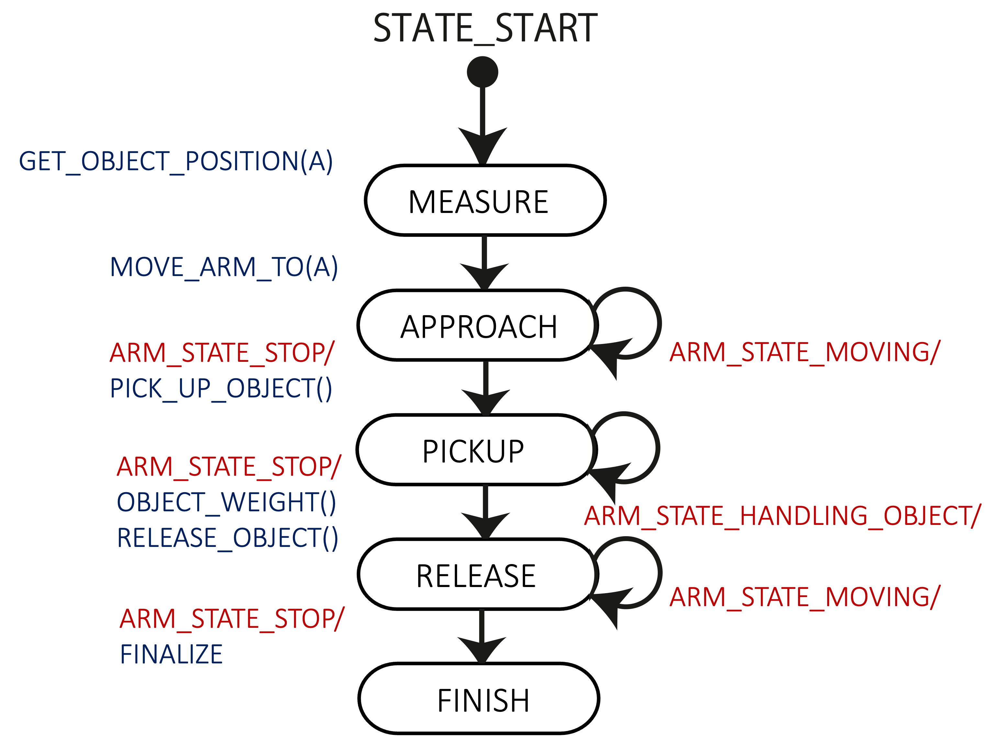

# 第2回 センサ値を取得しよう

第1回では，ロボットのアームの動かし方を学びました．第2回では，ロボットのアームを物体のところまで動かしたのち，物体を一度把持し，その質量を測るということをやってみます．

## 物体情報の取得とデータ処理

[サンプルプログラム(main2.c)](src/main2.c)をダウンロードして下さい．

ダウンロードしたmain2.cを，librobo.aのあるフォルダにコピーして，コンパイル・実行してください．OSX環境は[こちら](extraenv.md)のOSX環境を参照．
```
 gcc main2.c -o main2 -L. -lrobo -lm -lpthread -lfreeglut -lopengl32 -lglu32
```

このプログラムでは，一つの物体の位置へアームを移動させ，物体を把持し，その重量を計測します．物体の見た目の情報（位置，色，半径）は天井の視覚センサ（カメラ）で，物体の重量はグリッパの力覚センサで計測できると仮定します．ただし，簡単化のため，カメラ画像処理は省いており，物体番号を渡すとその位置，色，または，半径を返す関数が用意されています．また，これらのセンサ値にはノイズはないと仮定します．

まずは，その物体情報を格納するObject構造体を定義しましょう．
```
 typedef struct{
      int index;
      Position position;
      ColorRGB color;
      double radius;
      double weight;
 } Object;
```
indexは物体の番号を表すものとします．

get_object_position関数を用いて，object_index番目の物体の位置情報を取得できます．
```
 Position get_object_position(int object_index);
```
例えば，引数0は1番目の物体を意味します．

同様にして，色，半径，重量を以下の関数で取得できます．
```
 ColorRGB get_object_color_rgb(int object_index);
 double get_object_radius(int object_index);
 double get_held_object_weight();
```
ただし，重量値は物体を把持しているときのみ取得可能です．

色の情報は，robot_simulator.hで定義されている構造体ColorRGBを用いて扱うことができます．

```
struct ColorRGB_{
	int r;	// 0 ~ 255
	int g;	// 0 ~ 255
	int b;	// 0 ~ 255
};
typedef struct ColorRGB_ ColorRGB;
```
構造体のメンバーからわかるように，ここではR（赤），G（緑），B（青）の3つの値を用いて色が表現されています．

## 把持動作と重量情報の取得
ループの中で，取得した位置情報を元に，その物体の重量を計測します．
  
この処理は煩雑になるため，また，後で繰り返し使えるように，
```
 void approach_and_weigh(Object *object, int n);
 ```
に関数化しています．ここでのnは重量計測する物体の番号です．

アームが動いているときに指令を与えてもアームの動作の邪魔になるだけなので，
```
 if(get_arm_state() == ARM_STATE_STOP)
```
の条件をつけて，アームが止まっているときに限りapproach_and_weigh関数が処理されるようにします．approach_and_weigh関数では，課題の状態遷移に応じた場合分けをしています．
  
今回，位置測定 (MEASURE)，アームの移動 (APPROACH)，把持 (PICKUP)，重量測定と解放 (RELEASE)，終了 (FINISH) の５つの状態を仮定します．現在どの状態にあるのかはtask_stateに書いておきます．
  
この状態遷移を図に示すと以下の通りです．




task_stateをわかりやすくするために，プログラムの上に，enum型としてのTaskState型を次のように定義しています．
```
 typedef enum{
   MEASURE,
   APPROACH,
   PICKUP,
   RELEASE,
   FINISH
 } TaskState;
```

はじめ，
```
 TaskState task_state = MEASURE;
```
であるので，
```
 object[n].index = n + 1;
 object[n].position = get_object_position(n);
```
で(n + 1)番目の物体の位置を取得します（今回はn = 0なので，１番目）．

次に，APPROACHに状態遷移し，
```
 set_command_move_arm_to(object[n].position);
```
で，物体位置までアームを移動させます．

そして，PICKUPでは，
```
 set_command_pick_up_object();
```
で物体を把持します．

最後に，RELEASEでは
```
object[n].weight = get_held_object_weight();
```
にて重量を測定して，
```
set_command_release_object();
```
物体を離します．


状態がFINISHになると，main関数で物体情報を表示し，whileループをbreakすることで処理を終了します．このような，状態に応じた場合分けをすることで，状態ごとの処理がわかりやすくなり，見通しの良いプログラムになります．

## 練習

5個すべての物体の重量を計測・表示するプログラムを作成してください．  

### ヒント

何番目の物体を扱っているかを表す変数（例えば`int n`）を準備し，その物体への処理が終わって状態がFINISHになったときに，その変数を1増やして次の物体の処理へ進む，という流れにするとよいです．

ちなみに，
```
 while (update_robot()) {
  …
  }
```
の中にforループ文を入れる形では実装が難しいと思います．


## 課題


N個すべての物体の

- 位置
- 重量
- 色（R,G,Bのそれぞれの値）
- 半径

ならびに

- 課題の遂行にかかった時間

を表示するプログラムを作成してください．物体数Nはプログラム実行後にキーボード入力します．（Nは3以上，31以下とします）

ただし，この課題ではlibrobo.aではなく，librobo2.aを使って，以下のようにコンパイルしてください．***にはファイル名が入ります．OSX環境は[こちら](extraenv.md)のOSX環境を参照．
```
 gcc ***.c -o *** -L. -lrobo2 -lm -lpthread -lfreeglut -lopengl32 -lglu32
```

**このlibrobo2の環境では，グリッパが物体の把持や解放に失敗することがあります．** したがって，以下のような処理を追加してください．

- 物体の把持に失敗したときに，再度，把持するようにしてください．
- 物体の解放に失敗したときに，再度，解放するようにしてください．

#### ヒント1

グリッパが物体を把持しているか否かの状態は，`GripperState get_gripper_state()`にて取得できます．
物体の把持を（しようと）したあとで，グリッパーの状態が`GRIPPER_STATE_EMPTY`であれば，把持に失敗しています．
物体の解放を（しようと）したあとで，グリッパーの状態が`GRIPPER_STATE_HOLDING`であれば，解放に失敗しています．

#### ヒント2
物体の色は，`ColorRGB get_object_color_rgb(int object_index)`にて取得できます．色はColorRGB構造体を用いて表されており，そのメンバーであるr, g, bにそれぞれの値が入っています．

#### ヒント3

シミュレーション開始時からの経過時間は，`double get_system_time_in_sec()`にて取得できます．


Note: 適宜コメントを入れたり，関数化したりして，他人にもわかりやすいプログラムになるように心がけてください．全くコメントのないものは減点します．

Attention: 他人のプログラムを写したことが判明した場合は，両者とも0点になります．課題内容に対応していないプログラムにも点をつけません．

### 提出物

- 作成したプログラムファイル（ソースコード）．


### 提出先
 
CLE上のレポートbox

### 提出日

締め切りは，次回講義開始時刻まで．

- 1・2組：1/24 8:50
- 3・4組：1/27 13:30
